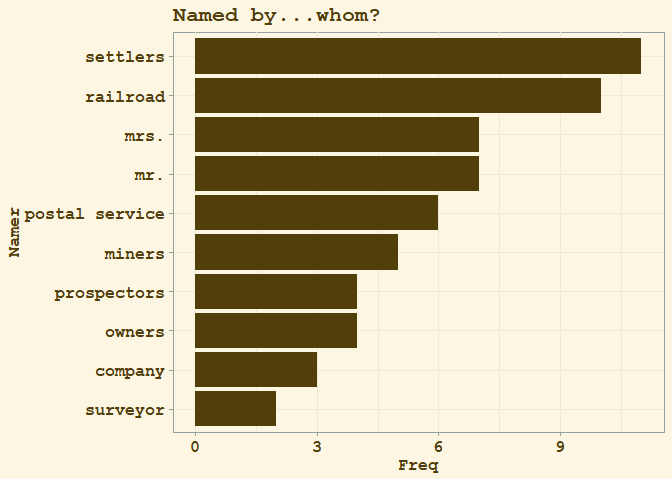
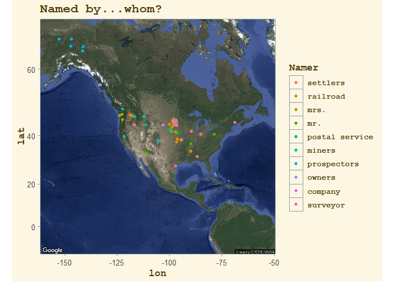

## Setup and Introduction


``` r
library(tidytuesdayR)
library(ggplot2)
library(ggthemes)
library(tidygeocoder)
library(ggmap)
library(quanteda)
library(stringr)
library(dplyr)
library(plotly)
library(htmlwidgets)
```


``` r
us_place_names <- readr::read_csv('https://raw.githubusercontent.com/rfordatascience/tidytuesday/main/data/2023/2023-06-27/us_place_names.csv')
us_place_history <- readr::read_csv('https://raw.githubusercontent.com/rfordatascience/tidytuesday/main/data/2023/2023-06-27/us_place_history.csv')
```

[This week's Tidy Tuesday dataset](https://github.com/rfordatascience/tidytuesday/blob/main/data/2023/2023-06-27/readme.md) contains data from the [National Map Staged Products Directory](https://prd-tnm.s3.amazonaws.com/index.html?prefix=StagedProducts/GeographicNames/) from the [US Board of Geographic Names](https://www.usgs.gov/us-board-on-geographic-names/download-gnis-data). It is geographic data that records the history of the names of key locations across the US. Because the data contains latitudes and longitudes, it will lend itself well to map-based visualizations. To create some of these visualizations, I would like to use Google Maps via the ggmap package. This requires acquiring an API key from Google and then registering it using ggmap. Anyone with a Google account can do this by creating a "dev" account. Google requires a credit card to be on file in order to obtain the API key; however, they do not actually charge the card unless you choose to upgrade your account.


``` r
##### MODIFY API KEY BASED ON USER #####
# I have hidden my API key
# To learn more, check out the ggmap package documentation
ggmap::register_google(key = irenes_api_key, write = TRUE)
```

A quick look at the datasets' column names shows a wealth of options for analysis. As a text data enthusiast, I can't help but notice the "history" variable, which provides the history behind the name each location was given.


``` r
colnames(us_place_names)
```

```
## [1] "feature_id"     "feature_name"   "state_name"     "county_name"   
## [5] "county_numeric" "date_created"   "date_edited"    "prim_lat_dec"  
## [9] "prim_long_dec"
```

``` r
colnames(us_place_history)
```

```
## [1] "feature_id"  "description" "history"
```

``` r
head(us_place_history$history, 15)
```

```
##  [1] NA                                                                                                                                                                                                                                                                                                                                                                               
##  [2] "Named in the 1890's by Josiah Harbert for his native town in California (AZ-T101)."                                                                                                                                                                                                                                                                                             
##  [3] "A man named Thomas coined the fname in the 1890's from Ariz (Arizona) plus Ola, the name of his daughter (AZ-T101)."                                                                                                                                                                                                                                                            
##  [4] "When a railroad station was established on the Avondale Ranch it was called 'Litchfield' and the post office established here in 1911 was named 'Avondale' (AZ-T101)."                                                                                                                                                                                                          
##  [5] "Hopi word for 'place of the jointed reed'.  A Hopi settlement (AZ-T101)."                                                                                                                                                                                                                                                                                                       
##  [6] "This is an Indian name reported to mean Indian woman 'with a long pointed nose' (AZ-T101)."                                                                                                                                                                                                                                                                                     
##  [7] "Named for Will H. Beardsley who initiated an irrigation project here in 1888 (AZ-T101)."                                                                                                                                                                                                                                                                                        
##  [8] "Founded in 1880."                                                                                                                                                                                                                                                                                                                                                               
##  [9] "The name was changed from 'Uhs Kug' to 'Blackwater' by the Gila River Pima-Maricopa Indian Community Council on June 19, 1940 (US-T121)."                                                                                                                                                                                                                                       
## [10] "Originally named for John Brayton Martin, who kept the Brayton Commercial Company, part of the Harqua Hala Mine.  Brayton post office, established in 1906, was changed to Bouse in 1907 at the request of local citizens.  The settlement was renamed for Thomas Bouse, a storekeeper or for George Bouse, a miner and gardener, or for both men (AZ-T101)."                   
## [11] "Named Buckeye in 1888 by Thomas Newton Clanton, G.L. Spain, and M.M. Jackson for the nickname of Ohio, the native state of Jackson and Clanton.  When a townsite was established on Clanton's land, he called it Sydney for Sydney, Ohio, his home town.  State supreme court action was needed to establish the name Buckeye in 1931 when the town was incorporated (AZ-T101)."
## [12] "The town was located in 1910 on the section that Jim Cashion owned as Cashion Ranch in 1900 (AZ-T101)."                                                                                                                                                                                                                                                                         
## [13] "Named for Alexander John Chandler (1859-1950), firstA HIST surgeon (AZ-T101)."                                                                                                                                                                                                                                                                                                  
## [14] "Named for Dr. Alexander John Chandler (1859-1950), first state veterinary surgeon 1887-1892, who created a corporation with C.A. Baldwin and others for raising citrus at this location (AZ-T101)."                                                                                                                                                                             
## [15] "This is a Papago Indian name meaning 'spring'.  The village was also called 'Copperosity' for the nearby Copperosity Mine.  It also may have been the 'Copperopolis' for which a post office was opened in 1884-85 (AZ-T101)."
```

The "history" snippets reveal an interesting pattern of language that I can exploit to investigate the origins of US place names. More specifically, many of the snippets use the phrase "named by," "named for," or "named by and for," followed by the person or entity that named the location. (For example, see numbers [2], [7], [10], [13], [14].) I can use basic text analysis tools to extract the word *after* these key phrases and thus analyze who named the different places or whom they were named after.

I will refer to these folks as "namers" going forward. So let's explore the namers in these datasets as well as the geographic distribution of the places they named.

## Step 1: Pre-Process the Text

I will begin by pre-processing the text in the "history" column using the quanteda package. Pre-processing steps for this text include:

* tokenization

* removing punctuation, symbols, numbers, URLs, and separators

* removing the words "a", "an", "the", "its"

The reasoning for the final step comes from the grammatical structure of the "named by" phrase. Though many text snippets may simply contain a name (e.g. "named by Joseph), others may involve entities (e.g. "named by the railroad"). For the ones that involve entities, I'd like to remove articles so that the words of interest (e.g. railroad) appears directly after the phrase "named by."

I have commented out some of the code below, because the pre-processing steps were somewhat iterative in nature. I would perform a step, then examine the words surrounding the phrase "named by," then perform additional steps as needed in a cyclical fashion.


``` r
# prep history variable for text analysis
history <- corpus(us_place_history$history)
h_toks <- tokens(history, remove_punct = TRUE,
                   remove_symbols = TRUE,
                   remove_numbers = TRUE,
                   remove_url = TRUE,
                   remove_separators = TRUE)
h_toks <- tokens_select(h_toks, c("a", "an", "the", "its"), selection = "remove")
keywords <- kwic(h_toks, phrase("named by"), 5)
#h_toks <- tokens_select(h_toks, stopwords('en'), selection = "remove")
#keywords <- kwic(h_toks, "named", 5)

# create document index for later merges
keywords$docidx <- str_replace(keywords$docname,"text(\\d+)","\\1")
head(keywords)
```

```
## Keyword-in-context with 6 matches.                                                          
##  [text26, 14:15] called Big Bend or Rinconada | Named by |
##    [text38, 1:2]                              | Named by |
##  [text46, 14:15]   of mountain Walls Well was | named by |
##    [text50, 2:3]                           So | named by |
##    [text60, 1:2]                              | Named by |
##    [text86, 1:2]                              | Named by |
##                                          
##  Father Francisco Garces Santos Apostales
##  John W Young in in                      
##  Frederick Wall miner who dug            
##  Brigham Young Jr in for                 
##  Milis Benson for palo verde             
##  Captain A.D Yocum in for
```


``` r
# extract words immediately after "named by" and "named by and for"
# save to Namer variable
keywords$Namer <- NA
for(i in 1:nrow(keywords)){
  
  phr <- keywords$post[i]
  
  if(str_detect(substr(phr, 1, 1), "[[:lower:]]")){
    
    if( (stringr::word(phr, 1)=="and") & 
        (stringr::word(phr, 2)=="for") ){
      if( (stringr::word(phr, 3)=="early") |
          (stringr::word(phr, 3)=="first") ){
        keywords$Namer[i] <- stringr::word(phr, 4)
      }else{
        keywords$Namer[i] <- stringr::word(phr, 3)
      }
    }else{
      if( (stringr::word(phr, 1)=="early") |
          (stringr::word(phr, 1)=="first") ){
        keywords$Namer[i] <- stringr::word(phr, 2)
      }else{
        keywords$Namer[i] <- stringr::word(phr, 1)
      }
    }
  }else{
    words <- unlist(str_split(phr, " "))
    Namer_prelim <- vector()
    for(j in 1:length(words)){
      if(str_detect(substr(words[j], 1, 1), "[[:upper:]]")){
        Namer_prelim <- c(Namer_prelim, stringr::word(words[j], 1))
      }
    }
    keywords$Namer[i] <- paste(Namer_prelim, collapse = " ")
  }
}

#head(keywords)
summary(as.factor(keywords$Namer))[1:20]
```

```
##                       settlers                         miners 
##                              7                              4 
##                    prospectors                       railroad 
##                              4                              4 
##                        settler                      officials 
##                              4                              3 
##                            him            Missouri Pacific RR 
##                              2                              2 
##                          owner                         owners 
##                              2                              2 
##                       surveyor                    Alex Joseph 
##                              2                              1 
##                 Alexander Marr          Antoine Barada French 
##                              1                              1 
##               Brigham Young Jr               C C Blankenbaker 
##                              1                              1 
##                      C H Prior      C.B Peck William Townsend 
##                              1                              1 
## C.E Simmons Lieutenant Rudolph              Captain A.D Yocum 
##                              1                              1
```

A quick look at the results shows a few issues that I would like to resolve. For example, "settler" and "settlers" should ideally be collapsed into the same term, as they are semantically the same. Therefore, I will combine singular and plural nouns by identifying namers that end in "s." Likewise I will combine the different railroads into "railroad," the different companies into "company," and any gendered terms into simply "mr." or "mrs."


``` r
# combine singular and plural Namers
for(elem in keywords$Namer){
  if(paste0(elem,"s") %in% unique(keywords$Namer)){
    keywords[which(keywords$Namer==elem),"Namer"] <- paste0(elem,"s")
  }
}

# fold together all railroads, postal, Mr/Mrs, company
keywords$Namer[str_which(keywords$Namer, regex('[Rr]ailroad'))] <- "railroad"
keywords$Namer[str_which(keywords$Namer, regex('[Rr]ailway'))] <- "railroad"
keywords$Namer[str_which(keywords$Namer, regex('\\bRR\\b'))] <- "railroad"
keywords$Namer[str_which(keywords$Namer, regex('\\b[Pp]ost'))] <- "postal service"
keywords$Namer[str_which(keywords$Namer, regex("\\bhim\\b"))] <- "mr."
keywords$Namer[str_which(keywords$Namer, regex("\\bher\\b"))] <- "mrs."
keywords$Namer[str_which(keywords$Namer, regex("M[Rr]\\.?\\b"))] <- "mr."
keywords$Namer[str_which(keywords$Namer, regex("M[Rr][Ss]\\.?\\b"))] <- "mrs."
keywords$Namer[str_which(keywords$Namer, regex("[Cc]ompany"))] <- "company"
# correct officials by hand
keywords$post[str_which(keywords$Namer, regex("[Oo]fficials"))]
```

```
## [1] "official act of Navajo Tribal"         
## [2] "officials of Milwaukee Railroad SD-T17"
## [3] "officials of Milwaukee Railroad SD-T17"
## [4] "officials for Kingdom of Servia"
```

``` r
keywords$Namer[str_which(keywords$Namer, regex("[Oo]fficials"))[1]] <- "official act"
keywords$Namer[str_which(keywords$Namer, regex("[Oo]fficials"))[2:3]] <- "railroad"
keywords$Namer[str_which(keywords$Namer, regex("[Oo]fficials"))[4]] <- "officials"

summary(as.factor(keywords$Namer))[1:20]
```

```
##                    Alex Joseph                 Alexander Marr 
##                              1                              1 
##          Antoine Barada French               Brigham Young Jr 
##                              1                              1 
##               C C Blankenbaker                      C H Prior 
##                              1                              1 
##      C.B Peck William Townsend C.E Simmons Lieutenant Rudolph 
##                              1                              1 
##              Captain A.D Yocum                  Charles James 
##                              1                              1 
##           Charles P Segerstrom                       citizens 
##                              1                              1 
##            Clyde Childers Name Colonel Samuel Sturgis Seventh 
##                              1                              1 
##                      combining                    community's 
##                              1                              1 
##                        company                    David Stone 
##                              3                              1 
##                 Dr Jesse Smith                       E Feeney 
##                              1                              1
```

Now that the text has been adequately pre-processed, it is time to merge my keyword dataset together with the two provided datasets to facilitate mapping. Luckily, all three datasets contain indices that allow easy merging. As a final step, I will eliminate any namers who only appear one time, as they are not of note and will crowd the plots.


``` r
# merge datasets together
keywords$docidx <- as.numeric(keywords$docidx)
us_place_history$docidx <- seq(1,nrow(us_place_history))
final_df <- inner_join(us_place_history, keywords, by = "docidx")    
final_df <- inner_join(final_df, us_place_names, by = "feature_id")
# get counts for Namer variable and merge
freq_counts <- as.data.frame(table(final_df$Namer))
colnames(freq_counts)[1] <- "Namer"
final_df <- inner_join(final_df, freq_counts, by="Namer")
# only include Namers that appear more than one time
final_df <- final_df[final_df$Freq>1,]
```

I can now begin creating descriptive plots about who exactly has named these various locations across the US. I will start by creating static ggplot plots and then will move to plotly for greater interactivity.

## Step 2: ggplot Visualizations


``` r
# set factor levels for consistency across plots
final_df$Namer <- factor(final_df$Namer, levels = unique(final_df$Namer[order(final_df$Freq, decreasing = FALSE)]))
```


``` r
# bar plot showing most common Namers
ggplot(data=final_df[!duplicated(final_df$Namer),], aes(x=Namer, y=Freq)) +
  geom_bar(stat="identity", fill="#523e09") +
  ggtitle("Named by...whom?") +
  coord_flip() +
  theme_solarized() + 
  theme(axis.title.x = element_text(size=13, 
                                    color="#523e09", 
                                    family="mono",
                                    face="bold"),
        axis.title.y = element_text(size=13,
                                    color="#523e09",
                                    family="mono",
                                    face="bold"),
        axis.text = element_text(size=13,
                                 color="#523e09",
                                 family="mono",
                                 face="bold"),
        plot.title = element_text(size=16,
                                  color="#523e09",
                                  family="mono",
                                  face="bold"))
```

<!-- -->

The static bar plot above clearly indicates that the largest number of places in the US were named by either "settlers" or "railroad" companies. Next lets see how the namers are distributed geographically across the country.


``` r
# flip factor levels because plots are stupid and inconsistent in ggplot
final_df$Namer <- factor(final_df$Namer, levels = rev(levels(final_df$Namer)))
```


``` r
# map showing where the Namers did the naming
m <- get_googlemap(center="Colorado",zoom=3,maptype = "satellite")
ggmap(m) + 
  geom_point(aes(x=prim_long_dec, y=prim_lat_dec, color=Namer), size=1.5, data=final_df) +
  ggtitle("Named by...whom?") +
  theme_solarized() + 
  theme(axis.title.x = element_text(size=13, 
                                    color="#523e09", 
                                    family="mono",
                                    face="bold"),
        axis.title.y = element_text(size=13,
                                    color="#523e09",
                                    family="mono",
                                    face="bold"),
        plot.title = element_text(size=16,
                                  color="#523e09",
                                  family="mono",
                                  face="bold"),
        legend.title = element_text(size=13,
                                    color="#523e09",
                                    family="mono",
                                    face="bold"),
        legend.text = element_text(size=10,
                                   color="#523e09",
                                   family="mono",
                                   face="bold"),
        legend.key = element_rect(fill = "#fdf6e3"))
```

<!-- -->

The map above shows some interesting trends, with settlers naming more places in the eastern half of the US and other groups, such as prospectors and the postal service, naming more locations in the western half of the US.

## Step 3: plotly Visualizations


``` r
# PLOTLY setup
my_font <- list(
  family = "Courier",
  size = 10,
  color = '#523e09',
  face = 'bold')
```


``` r
fig1 <- plot_ly(final_df, x = ~Freq, y = ~Namer, type = 'histogram', color=~Namer, orientation = 'h') %>% 
  layout(title = 'Named by...whom?',
         yaxis = list(autorange = "reversed"),
         font=my_font)
fig1
```

```plotly
<div class="plotly html-widget html-fill-item" id="htmlwidget-1a2b6e2b6e3e323b9a72" style="width:672px;height:480px;"></div>
<script type="application/json" data-for="htmlwidget-1a2b6e2b6e3e323b9a72">{"x":{"visdat":{"168850514597":["function () ","plotlyVisDat"]},"cur_data":"168850514597","attrs":{"168850514597":{"x":{},"y":{},"orientation":"h","color":{},"alpha_stroke":1,"sizes":[10,100],"spans":[1,20],"type":"histogram"}},"layout":{"margin":{"b":40,"l":60,"t":25,"r":10},"title":"Named by...whom?","yaxis":{"domain":[0,1],"automargin":true,"autorange":"reversed","title":"Namer","type":"category","categoryorder":"array","categoryarray":["settlers","railroad","mrs.","mr.","postal service","miners","prospectors","owners","company","surveyor"]},"font":{"family":"Courier","size":10,"color":"#523e09","face":"bold"},"xaxis":{"domain":[0,1],"automargin":true,"title":"Freq"},"hovermode":"closest","showlegend":true},"source":"A","config":{"modeBarButtonsToAdd":["hoverclosest","hovercompare"],"showSendToCloud":false},"data":[{"x":[11,11,11,11,11,11,11,11,11,11,11],"y":["settlers","settlers","settlers","settlers","settlers","settlers","settlers","settlers","settlers","settlers","settlers"],"orientation":"h","type":"histogram","name":"settlers","marker":{"color":"rgba(102,194,165,1)","line":{"color":"rgba(102,194,165,1)"}},"textfont":{"color":"rgba(102,194,165,1)"},"error_y":{"color":"rgba(102,194,165,1)"},"error_x":{"color":"rgba(102,194,165,1)"},"xaxis":"x","yaxis":"y","frame":null},{"x":[10,10,10,10,10,10,10,10,10,10],"y":["railroad","railroad","railroad","railroad","railroad","railroad","railroad","railroad","railroad","railroad"],"orientation":"h","type":"histogram","name":"railroad","marker":{"color":"rgba(228,156,113,1)","line":{"color":"rgba(228,156,113,1)"}},"textfont":{"color":"rgba(228,156,113,1)"},"error_y":{"color":"rgba(228,156,113,1)"},"error_x":{"color":"rgba(228,156,113,1)"},"xaxis":"x","yaxis":"y","frame":null},{"x":[7,7,7,7,7,7,7],"y":["mrs.","mrs.","mrs.","mrs.","mrs.","mrs.","mrs."],"orientation":"h","type":"histogram","name":"mrs.","marker":{"color":"rgba(201,152,157,1)","line":{"color":"rgba(201,152,157,1)"}},"textfont":{"color":"rgba(201,152,157,1)"},"error_y":{"color":"rgba(201,152,157,1)"},"error_x":{"color":"rgba(201,152,157,1)"},"xaxis":"x","yaxis":"y","frame":null},{"x":[7,7,7,7,7,7,7],"y":["mr.","mr.","mr.","mr.","mr.","mr.","mr."],"orientation":"h","type":"histogram","name":"mr.","marker":{"color":"rgba(175,154,200,1)","line":{"color":"rgba(175,154,200,1)"}},"textfont":{"color":"rgba(175,154,200,1)"},"error_y":{"color":"rgba(175,154,200,1)"},"error_x":{"color":"rgba(175,154,200,1)"},"xaxis":"x","yaxis":"y","frame":null},{"x":[6,6,6,6,6,6],"y":["postal service","postal service","postal service","postal service","postal service","postal service"],"orientation":"h","type":"histogram","name":"postal service","marker":{"color":"rgba(226,148,184,1)","line":{"color":"rgba(226,148,184,1)"}},"textfont":{"color":"rgba(226,148,184,1)"},"error_y":{"color":"rgba(226,148,184,1)"},"error_x":{"color":"rgba(226,148,184,1)"},"xaxis":"x","yaxis":"y","frame":null},{"x":[5,5,5,5,5],"y":["miners","miners","miners","miners","miners"],"orientation":"h","type":"histogram","name":"miners","marker":{"color":"rgba(176,208,99,1)","line":{"color":"rgba(176,208,99,1)"}},"textfont":{"color":"rgba(176,208,99,1)"},"error_y":{"color":"rgba(176,208,99,1)"},"error_x":{"color":"rgba(176,208,99,1)"},"xaxis":"x","yaxis":"y","frame":null},{"x":[4,4,4,4],"y":["prospectors","prospectors","prospectors","prospectors"],"orientation":"h","type":"histogram","name":"prospectors","marker":{"color":"rgba(227,217,62,1)","line":{"color":"rgba(227,217,62,1)"}},"textfont":{"color":"rgba(227,217,62,1)"},"error_y":{"color":"rgba(227,217,62,1)"},"error_x":{"color":"rgba(227,217,62,1)"},"xaxis":"x","yaxis":"y","frame":null},{"x":[4,4,4,4],"y":["owners","owners","owners","owners"],"orientation":"h","type":"histogram","name":"owners","marker":{"color":"rgba(245,207,100,1)","line":{"color":"rgba(245,207,100,1)"}},"textfont":{"color":"rgba(245,207,100,1)"},"error_y":{"color":"rgba(245,207,100,1)"},"error_x":{"color":"rgba(245,207,100,1)"},"xaxis":"x","yaxis":"y","frame":null},{"x":[3,3,3],"y":["company","company","company"],"orientation":"h","type":"histogram","name":"company","marker":{"color":"rgba(219,192,155,1)","line":{"color":"rgba(219,192,155,1)"}},"textfont":{"color":"rgba(219,192,155,1)"},"error_y":{"color":"rgba(219,192,155,1)"},"error_x":{"color":"rgba(219,192,155,1)"},"xaxis":"x","yaxis":"y","frame":null},{"x":[2,2],"y":["surveyor","surveyor"],"orientation":"h","type":"histogram","name":"surveyor","marker":{"color":"rgba(179,179,179,1)","line":{"color":"rgba(179,179,179,1)"}},"textfont":{"color":"rgba(179,179,179,1)"},"error_y":{"color":"rgba(179,179,179,1)"},"error_x":{"color":"rgba(179,179,179,1)"},"xaxis":"x","yaxis":"y","frame":null}],"highlight":{"on":"plotly_click","persistent":false,"dynamic":false,"selectize":false,"opacityDim":0.20000000000000001,"selected":{"opacity":1},"debounce":0},"shinyEvents":["plotly_hover","plotly_click","plotly_selected","plotly_relayout","plotly_brushed","plotly_brushing","plotly_clickannotation","plotly_doubleclick","plotly_deselect","plotly_afterplot","plotly_sunburstclick"],"base_url":"https://plot.ly"},"evals":[],"jsHooks":[]}</script>
```


``` r
# break up text for upcoming plotly hovertext
final_df$hovertext <- final_df$history
for(i in 1:nrow(final_df)){
  final_df$hovertext[i] <- paste(substring(final_df$history[i], 
                                           seq(1, nchar(final_df$history[i]), 30), 
                                           seq(30, nchar(final_df$history[i])+1, 30)), 
                                 collapse = "<br>")
}
final_df$hovertext <- ""
for(i in 1:nrow(final_df)){
  splitup <- unlist(strsplit(final_df$history[i], split=" "))
  for(j in seq(1, length(splitup), 6)){
    subvec <- paste(na.omit(splitup[j:(j+5)]), collapse = " ")
    final_df$hovertext[i] <- paste(final_df$hovertext[i], subvec, sep = "<br>")
  }
  final_df$hovertext[i]
}
final_df$hovertext <- substring(final_df$hovertext, 5)
```


``` r
# plotly code from https://plotly.com/r/scatter-plots-on-maps/
# geo styling
g <- list(
  scope = 'usa',
  projection = list(type = 'albers usa'),
  showland = TRUE,
  landcolor = toRGB("#fdf6e3"),
  subunitcolor = toRGB("#fdf6e3"),
  countrycolor = toRGB("#fdf6e3"),
  countrywidth = 0.5,
  subunitwidth = 0.5
)

fig2 <- plot_geo(final_df, lat = ~prim_lat_dec, lon = ~prim_long_dec)
fig2 <- fig2 %>% add_markers(
  text = ~hovertext,
  color = ~Namer, 
  symbol = I("square"), 
  size = I(20),
  hoverinfo = "text"
)
fig2 <- fig2 %>% layout(
  title = 'Named by...whom?<br />(Hover for full history)', geo = g,
  font = my_font)

fig2
```

```plotly
<div class="plotly html-widget html-fill-item" id="htmlwidget-53006f86af138c612caa" style="width:672px;height:480px;"></div>
<script type="application/json" data-for="htmlwidget-53006f86af138c612caa">{"x":{"visdat":{"16887f131b00":["function () ","plotlyVisDat"]},"cur_data":"16887f131b00","attrs":{"16887f131b00":{"lat":{},"lon":{},"alpha_stroke":1,"sizes":[10,100],"spans":[1,20],"x":{},"y":{},"type":"scatter","mode":"markers","text":{},"color":{},"symbol":["square"],"size":[20],"hoverinfo":"text","inherit":true}},"layout":{"margin":{"b":40,"l":60,"t":25,"r":10},"mapType":"geo","title":"Named by...whom?<br />(Hover for full history)","geo":{"domain":{"x":[0,1],"y":[0,1]},"scope":"usa","projection":{"type":"albers usa"},"showland":true,"landcolor":"rgba(253,246,227,1)","subunitcolor":"rgba(253,246,227,1)","countrycolor":"rgba(253,246,227,1)","countrywidth":0.5,"subunitwidth":0.5},"font":{"family":"Courier","size":10,"color":"#523e09","face":"bold"},"hovermode":"closest","showlegend":true},"source":"A","config":{"modeBarButtonsToAdd":["hoverclosest","hovercompare"],"showSendToCloud":false},"data":[{"lat":[31.829597199999998,46.5954452,43.749049999999997,41.5575349,40.434489499999998,44.570352200000002,38.266967800000003,38.432238900000002,44.958296199999999,43.881087299999997,45.049688000000003],"lon":[-86.617751699999999,-116.8012667,-116.96182,-89.460927600000005,-84.977745499999997,-68.735864199999995,-94.495786699999996,-94.347448700000001,-97.581472000000005,-97.504512099999999,-98.095646400000007],"type":"scattergeo","mode":"markers","text":["Became the county seat of Butler<br>County in 1822. Named by early<br>settlers from the town in South<br>Carolina.","A small pioneer community near Genesee.<br>Said locally to have been named<br>by a settler.","Named by and for an early<br>settler, a school teacher, who dreamed<br>of founding a town in that<br>spot. Founded in 1889.","Named by settlers from.the State of<br>Ohio.","Settled in 1837. Named by early<br>settlers from Portland, Maine.","Said to have been so named<br>by the first settler because of<br>the finding of an oar upon<br>the shore.","Laid out in 1871, and named<br>by the early settlers from Virginia,<br>for their home state.  (MO-T101)","Union Town (later Crescent Hill) -<br>The first name of a town<br>near central Deer Creek Township; surveyed<br>in Feb. 1858.  Named by<br>settlers from Pennsylvania for Uniontown, PA.<br> Cresent Hill - This name,<br>which replaced the name Union Town,<br>was given in 1862 to the<br>community from the round hill on<br>which it was situated.  This<br>community was missed by the Missouri<br>Pacific Railroad and is no longer<br>in existence.  (MO-T101)","Settled in 1889 and named by<br>early settlers Mr and Mrs P<br>S Carpenter for its  picturesque<br>beauty.  (SD-T17/p65)","Founded in 1883 and named by<br>settlers for Italian Sculptor Antonio Canova<br>(1857-1822).(SD-T17/p53) Incorporated in 1898.","Named by an early settler from<br>Turton in Lancashire, England. It was<br>platted in 1886. (SD-T83/p. 132) Incorporated<br>in 1905."],"hoverinfo":["text","text","text","text","text","text","text","text","text","text","text"],"name":"settlers","marker":{"color":"rgba(102,194,165,1)","size":[20,20,20,20,20,20,20,20,20,20,20],"sizemode":"area","symbol":"square","line":{"color":"rgba(102,194,165,1)"}},"textfont":{"color":"rgba(102,194,165,1)","size":20},"line":{"color":"rgba(102,194,165,1)","width":20},"geo":"geo","frame":null},{"lat":[32.879502199999997,37.536132899999998,38.643063699999999,33.882058700000002,45.738006900000002,43.4741517,45.1555313,43.903601999999999,46.922920099999999,46.868481699999997],"lon":[-111.75735210000001,-96.641965400000004,-96.257219500000005,-89.829531599999996,-97.9212165,-97.985627699999995,-98.579262900000003,-99.861783399999993,-118.75471810000001,-118.3241383],"type":"scattergeo","mode":"markers","text":["So named by the railroad as<br>it was the nearest stop, at<br>that time, to the Casa Grande<br>Ruins (AZ-T101).","Named by Missouri Pacific RR in<br>the 1880s for Arlie Latham, member<br>of the St. Louis Browns baseball<br>team (US-T131/1994/Invention & Technology Mag/p21) Platted<br>in 1885.","Named by Missouri Pacific RR in<br>the 1880s for Dock Bushong, catcher<br>for the St. Louis Browns baseball<br>team (US-T131/1994/Invention & Technology Mag/p21) Founded<br>in 1886 and incorporated in 1927.","Named by the railroad company for<br>Richard Hardy, the owner of the<br>land upon which the depot was<br>built.","Named by the Great Northern Railway<br>Company, likely for Amherst, Massachusetts. (SD-T17/p46)","The town was named by Milwaukee<br>Railroad officials for the man who<br>surveyed the town site in 1885.<br> The town was platted in<br>1910.  (SD-T17/p59)","Named by the railroad company from<br>the fact that the station was<br>the most northerly station on the<br>railroad. (SD-T83/p. 108) Platted in 1881<br>and incorporated in 1909.","Founded in 1905 and named by<br>officials of the Milwaukee Railroad.(SD-T17/p73-4) Incorporated<br>in 1909. Became the county seat<br>of Lyman County in 1922.","When the Milwaukee Railway was built<br>through the area, the station was<br>named by its officials for the<br>Kingdom of Servia, later part of<br>Yugoslavia (Place Names of WA/p269).","Named by railroad officials in 1889<br>for James F. Fletcher, who owned<br>the land on which the station<br>was built."],"hoverinfo":["text","text","text","text","text","text","text","text","text","text"],"name":"railroad","marker":{"color":"rgba(228,156,113,1)","size":[20,20,20,20,20,20,20,20,20,20],"sizemode":"area","symbol":"square","line":{"color":"rgba(228,156,113,1)"}},"textfont":{"color":"rgba(228,156,113,1)","size":20},"line":{"color":"rgba(228,156,113,1)","width":20},"geo":"geo","frame":null},{"lat":[41.423342599999998,41.342790299999997,44.284134799999997,43.027496999999997,46.9753708,47.290096599999998,45.643728699999997],"lon":[-99.126204000000001,-97.238372699999999,-96.685606000000007,-98.888422800000001,-123.81572180000001,-122.66763109999999,-122.3720367],"type":"scattergeo","mode":"markers","text":["Established in 1885 and named by<br>Mrs Samuel A Hawthorne who served<br>as the first Postmistress for the<br>community.  This community was originally<br>named Brownville in honor of Porter<br>Brown, an original settler.  Another<br>town named Brownville already existed in<br>the State, therefore the name was<br>changed to Arcadia, which reportedly means<br>\"the feast of flowers\", likely referring<br>to the many flowers in bloom.<br> (NE-T18)","Named by Mrs Mary B Finch,<br>for Jessee D Bell, founder of<br>the community. Mr Bell donated the<br>land for the town and contributed<br>to the vast amount of shrubry,<br>plants and unique trees in the<br>town. (NE-T18/p29) Platted in 1890.","Named by Mrs. W.R. Stowe of<br>Brookings, SD from Aurora, IL, her<br>old home, which was named from<br>Aurora, NY, from Latin word meaning<br>\"morning,\" \"dawn,\" \"east.\" (SD-T83/p. 40)","Named by Mrs Isabella B Turney<br>of the Turney family who owned<br>much land in the vicinity from<br>Fairfax Court House, VA. (SD-T83/ p.<br>70) This community was settled after<br>the opening of the Indian Territory.<br>(SD-T17/p62) Founded in 1890.","Named by Mrs. James Stewart for<br>her home town of Aberdeen, Scotland.<br>See \"Derivation of Washington State Town<br>Names\", DeWitt C. Francis, 1971. Founded<br>in 1867.","Named by Mrs. G.W. Powell in<br>1893; part of the name is<br>from her eldest daughter, Arla, and<br>part is from a city in<br>Malta, Veletta. See \"Description of Washington<br>State Town Names\", DeWitt C. Francis,<br>1971","Named by Mrs. Blackwood, early homesteader.<br> 14mi east of Vancouver, north<br>of Little Washougal River."],"hoverinfo":["text","text","text","text","text","text","text"],"name":"mrs.","marker":{"color":"rgba(201,152,157,1)","size":[20,20,20,20,20,20,20],"sizemode":"area","symbol":"square","line":{"color":"rgba(201,152,157,1)"}},"textfont":{"color":"rgba(201,152,157,1)","size":20},"line":{"color":"rgba(201,152,157,1)","width":20},"geo":"geo","frame":null},{"lat":[33.533382000000003,38.172804499999998,36.955606400000001,46.632712400000003,41.039164999999997,40.485071699999999],"lon":[-111.30623869999999,-94.182168899999994,-89.868144099999995,-112.3219605,-96.368346000000003,-78.724742699999993],"type":"scattergeo","mode":"markers","text":["Named by Mr. Jack Frasier, the<br>original settler and stationmaster (US-T121).","Settled about 1840, laid out by<br>Joseph Smith and named by him<br>for its pleasant location in a<br>gap between hills covered with timber.<br> (MO-T101)","Named by Mr. Crumb, who built<br>the railroad in Stoddard Co. in<br>1910.  He named the station<br>his line had reached Zeta, becausehe<br>was interested in learning how to<br>make the sixth letter of the<br>Greek alphabet. (MO Place Names/p96)","Blossburg was the name of a<br>station along the Northern Pacific Railroad<br>and was named by a Mr.<br>Wicks, a mining engineer, after a<br>Pennsylvania coal mining town spelled Blosburg.<br> This community was formerly called<br>Mullan, named for Captain John Mullan<br>who was a member of the<br>Stevens Survey of 1853.  That<br>Survey explored Montana in search of<br>routes for a transcontinental railroad. <br>The name was later changed to<br>Blossburg because mail shipments kept being<br>inadvertently sent to Mullan, Idaho.","Founded on 4 March 1870 and<br>named by a Mr Argyle for<br>Ashland, Kentucky, home of Henry Clay,<br>his favorite politician.  (NE-T18/p126)","laid out by the Reverend Rees<br>Lloyd, and named by him for<br>his eldest son, Eben"],"hoverinfo":["text","text","text","text","text","text"],"name":"mr.","marker":{"color":"rgba(175,154,200,1)","size":[20,20,20,20,20,20],"sizemode":"area","symbol":"square","line":{"color":"rgba(175,154,200,1)"}},"textfont":{"color":"rgba(175,154,200,1)","size":20},"line":{"color":"rgba(175,154,200,1)","width":20},"geo":"geo","frame":null},{"lat":[43.824916299999998,46.599340099999999,40.871943799999997,42.202500999999998,45.181346699999999,48.980948499999997],"lon":[-111.1796679,-116.5437617,-96.387510000000006,-99.604285899999994,-97.683421999999993,-122.5248874],"type":"scattergeo","mode":"markers","text":["Post office 1890-1913. Townsite dedicated in<br>1905. Most establishments moved to Tetonia<br>when Union Pacific RR came through.<br>Named by US Postal Service to<br>honor federal geologist and surveyor F.<br>V. Hayden.","Said locally to have been named<br>by first postmaster Roger Drury for<br>Chief Justice Roger Brooke Taney, US<br>Supreme Court 1836-64, whom he admired.","Named by the Post Office Department<br>in Washington, DC.  Name origin<br>unknown.  (NE-T18/p30)","Named by the US Post Office<br>Department. (MO-T109/p121)","Founded in 1887 and named by<br>Ross E Parks, the first Postmaster<br>for the village, for his sister,<br>Lily.  (SD-T17/p76)","Named by James Bremmer of the<br>U.S. Postal Service."],"hoverinfo":["text","text","text","text","text","text"],"name":"postal service","marker":{"color":"rgba(226,148,184,1)","size":[20,20,20,20,20,20],"sizemode":"area","symbol":"square","line":{"color":"rgba(226,148,184,1)"}},"textfont":{"color":"rgba(226,148,184,1)","size":20},"line":{"color":"rgba(226,148,184,1)","width":20},"geo":"geo","frame":null},{"lat":[33.183393299999999,38.097223800000002,39.513775199999998,46.592712200000001,64.154166700000005],"lon":[-110.99761410000001,-105.33611000000001,-121.556359,-112.036109,-141.45972219999999],"type":"scattergeo","mode":"markers","text":["Named by a miner named Bullinger<br>for his sister when he opened<br>the Ray Mine and started the<br>Ray Copper Company in 1882 (AZ-T101).","Said to have been so named<br>by the early miners because of<br>the thickets of wild roses which<br>surrounded the springs in the vicinity.","Became the county seat of Butte<br>County in 1856. Incorporated in 1906.<br>Named by the early miners because<br>of the gold mines.","Named by miners after Saint Helena,<br>Minnesota. The native variant name translates<br>as “Possessing Red Paint.”","mining camp named by miners for<br>Jack Wade, prospector;  reported in<br>1903 by T. G. Gerdine (in<br>Prindle, 1905, pl. 16), U.S. Geological<br>Survey (USGS). post  office was<br>established in 1901 and maintained until<br>1948 (Ricks, 1965, p. 29). 1940."],"hoverinfo":["text","text","text","text","text"],"name":"miners","marker":{"color":"rgba(176,208,99,1)","size":[20,20,20,20,20],"sizemode":"area","symbol":"square","line":{"color":"rgba(176,208,99,1)"}},"textfont":{"color":"rgba(176,208,99,1)","size":20},"line":{"color":"rgba(176,208,99,1)","width":20},"geo":"geo","frame":null},{"lat":[66.466388899999998,65.074444400000004,66.5,64.933333300000001],"lon":[-146.90222220000001,-147.2127778,-152.8833333,-141.28333330000001],"type":"scattergeo","mode":"markers","text":["Indian settlement named by prospectors about<br>1898 for the chief; name published<br>on an 1898 manuscript map by<br>E. F. Ball, prospector, as \"White<br>Eye's Camp.\" The 1940 Census gave<br>a population of 15.","Name published in 1907 by U.S.<br>Geological Survey (USGS) as Mehan, an<br>abandoned gold dredging camp. The settlement<br>began about 1905 (Kitchner, 1954, p.<br>297) and was named by prospectors<br>for an early miner, Pat Meehan.<br>A post office was established here<br>in 1906 and maintained until 1942<br>(Ricks, 1965, p. 41).","named by prospectors for the operator<br>of the trading post;  reported<br>in 1899 by T. G. Gerdine<br>(in Schrader, 1900, pl. 60), U.S.<br>Geological Survey (USGS). height of the<br>Koyukuk gold rush because it was<br>a transfer point for supplies and<br>was situated near the head of<br>navigation for the larger riverboats on<br>Koyukuk. abandoned on 1913 map.","Named by prospectors and reported as<br>\"Star City\" in 1897 by Lieutenant<br>W. P. Richardson, USA. A post<br>office was maintained here from 1898<br>to 1902 (Ricks, 1965, p. 60)."],"hoverinfo":["text","text","text","text"],"name":"prospectors","marker":{"color":"rgba(227,217,62,1)","size":[20,20,20,20],"sizemode":"area","symbol":"square","line":{"color":"rgba(227,217,62,1)"}},"textfont":{"color":"rgba(227,217,62,1)","size":20},"line":{"color":"rgba(227,217,62,1)","width":20},"geo":"geo","frame":null},{"lat":[44.4924824,45.333852100000001,55.958888899999998,56.034444399999998],"lon":[-98.349259599999996,-96.763123100000001,-133.24333329999999,-133.49111110000001],"type":"scattergeo","mode":"markers","text":["Named by the owner of the<br>farm adjoining the station, from the<br>broad valley in which the farm<br>and station are located. (SD-T83/ p.<br>47) Incorporated on 5 December 1911.","Established in 1883 and first named<br>by the owner of the town<br>site, C H Prior.  The<br>name was later changed and it<br>is believed to be named for<br>Corona, borough of Queens, New York.<br> (SD-T17/p57)","Local name reported in 1904 by<br>E. F. Dickins, U.S. Coast and<br>Geodetic Survey (USC&GS), who \"Found name<br>on painted sign board over door<br>of Fishery, probably named by owners.\"<br>This place was a fishing station,<br>now abandoned.","This is the site of an<br>abandoned fishing station. Named by the<br>owners and reported in 1904 by<br>E. F. Dickins, U.S. Coast and<br>Geodetic Survey (USC&GS)."],"hoverinfo":["text","text","text","text"],"name":"owners","marker":{"color":"rgba(245,207,100,1)","size":[20,20,20,20],"sizemode":"area","symbol":"square","line":{"color":"rgba(245,207,100,1)"}},"textfont":{"color":"rgba(245,207,100,1)","size":20},"line":{"color":"rgba(245,207,100,1)","width":20},"geo":"geo","frame":null},{"lat":[44.366920100000002,43.839712400000003,43.549974900000002],"lon":[-97.850917100000004,-103.19102049999999,-96.700327000000001],"type":"scattergeo","mode":"markers","text":["Platted in 1880 and named by<br>the Western Town Lot Company for<br>the Iroquois Branch of the Northwestern<br>Railroad. \"Iroquois\" translates to \"heart people\"<br>or \"people of God\" which was<br>applied by the French to the<br>Indian confederacy of the Six Nations.<br>(SD-T17/p72) Incorporated on 26 August 1887.","Descriptive name from the Spanish word<br>meaning \"beautiful\".  Located and named<br>by the Pioneer Town Site Company<br>in 1886.  (SD-T83/P83)","This place was named by the<br>Dakota Land Company for the falls<br>of the Big Sioux River that<br>runs through the place.  (SD-T83/p.<br>192)"],"hoverinfo":["text","text","text"],"name":"company","marker":{"color":"rgba(219,192,155,1)","size":[20,20,20],"sizemode":"area","symbol":"square","line":{"color":"rgba(219,192,155,1)"}},"textfont":{"color":"rgba(219,192,155,1)","size":20},"line":{"color":"rgba(219,192,155,1)","width":20},"geo":"geo","frame":null},{"lat":[44.839686899999997,27.997240999999999],"lon":[-96.689503900000005,-97.060267300000007],"type":"scattergeo","mode":"markers","text":["Named by the surveyor who laid<br>out the town site, because of<br>the hilly country surrounding it. (SD-T83/p.<br>36) Another theory states that this<br>community was named for the person<br>whose farm the town was established<br>on, Ed Altamont. The town was<br>platted in 1880 by the Western<br>Town Lot Company. (SD-T17/p46) Incorporated in<br>1903.","So named by surveyor Arthur A<br>Stiles because his favorite saddle horse<br>fell from one of the cliffs<br>there (TX-T99/R Maxwell)"],"hoverinfo":["text","text"],"name":"surveyor","marker":{"color":"rgba(179,179,179,1)","size":[20,20],"sizemode":"area","symbol":"square","line":{"color":"rgba(179,179,179,1)"}},"textfont":{"color":"rgba(179,179,179,1)","size":20},"line":{"color":"rgba(179,179,179,1)","width":20},"geo":"geo","frame":null}],"highlight":{"on":"plotly_click","persistent":false,"dynamic":false,"selectize":false,"opacityDim":0.20000000000000001,"selected":{"opacity":1},"debounce":0},"shinyEvents":["plotly_hover","plotly_click","plotly_selected","plotly_relayout","plotly_brushed","plotly_brushing","plotly_clickannotation","plotly_doubleclick","plotly_deselect","plotly_afterplot","plotly_sunburstclick"],"base_url":"https://plot.ly"},"evals":[],"jsHooks":[]}</script>
```


## Conclusion

This final interactive map is kind of the coolest visualization, because you can actually read the full name history by hovering over locations of interest.

My personal favorite comes from my home state of Texas where surveyor Arthur A. Stiles is said to have named a location (Sierra del Caballo Muerto) after his favorite saddle horse, who fell from a cliff there and tragically died. R.I.P.

You can learn more about Sierra del Caballo Muerto [here](https://www.tshaonline.org/handbook/entries/sierra-del-caballo-muerto).
